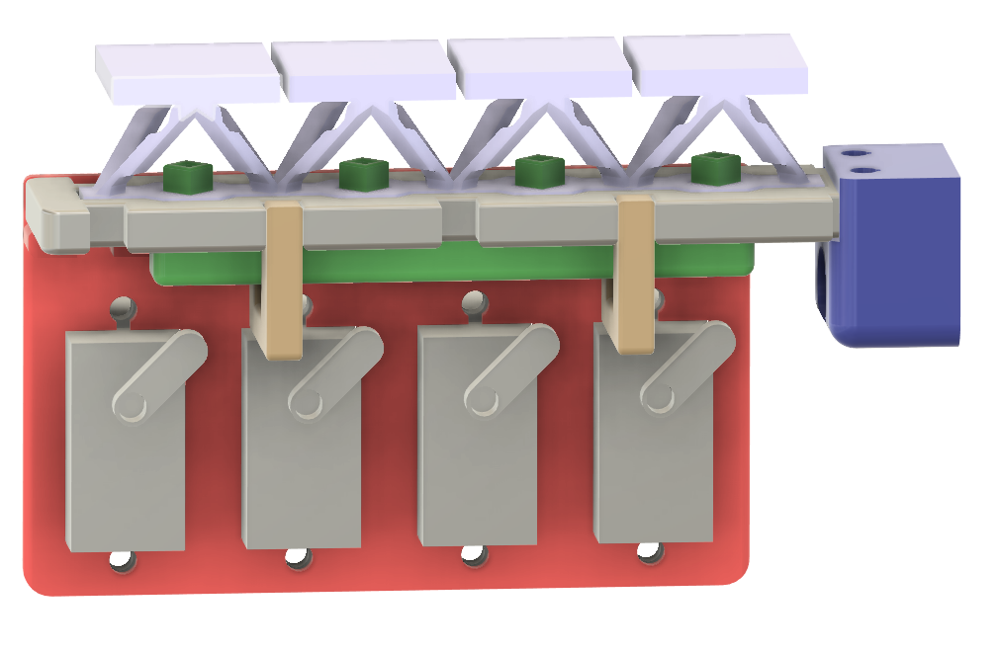
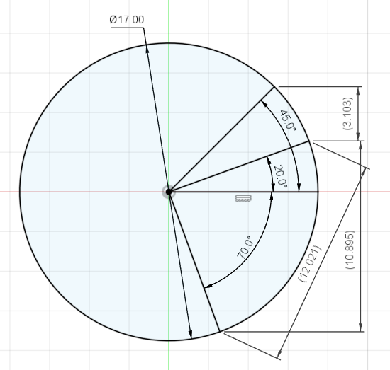

This is the current design of the finger that we are going for:

So it will be 4 individual servos to control each individual cell. They go through a specific range of motion. We can say that the neutral position is +20 deg, and to pull the cell down, it rotates to -70 deg (so 90deg rotation) to pull on the tendon. To push the cell back up, it will rotate counter clockwise to +45 deg to push the green bar up. These angles are approximate and we'll have to tune them once we actually manufacture the full finger. So it will actually be 3 positions: pull, push, and neutral. You can look into either controlling via topics or actions. 

Note that RIGHT NOW, the green bar to reset the cells is a solid bar, so all servos/cells should reset at the same time (and all servos should be rotating counter clockwise at the same time, regardless of state). But, in the future, we might want to individually reset cells, so make sure that cell reset is still separate commands for each servo.